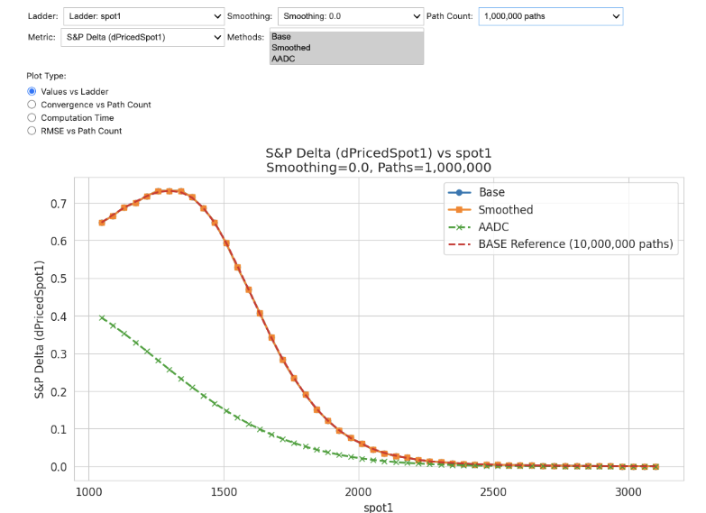
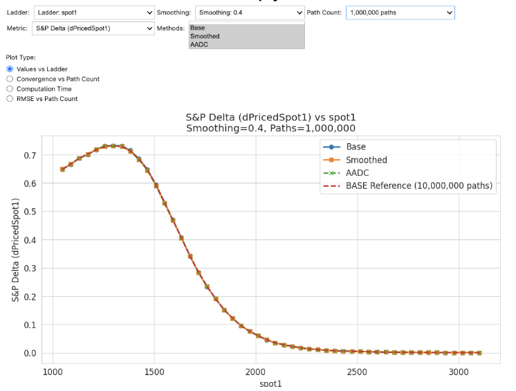

# Phoenix Autocallable Note - AAD vs Bump & Revalue Benchmark

## Overview

This repository provides a benchmark comparing Automatic Adjoint Differentiation (AAD) and traditional Bump & Revalue methods for calculating sensitivities of Phoenix Autocallable Notes. The focus is on addressing the challenges of calculating accurate Greeks for non-smooth payoffs through smoothing techniques combined with AAD, therefore we use simplified log normal model assumptions and focus on handling discontinuous payoffs.

### 1. What is a Phoenix Autocallable Note?

A structured product linked to multiple underlying assets with three key features:

1. **Contingent Coupon Payments**: Periodic coupons paid only if all underlying assets are above their respective barrier levels
2. **Early Redemption (Autocall)**: Automatic early redemption if all underlying assets are at or above their initial levels on observation dates
3. **Principal Protection with Barrier**: Full principal returned at maturity if worst-performing asset remains above the barrier; otherwise, investor participates in the downside

### 2. Test Case Specification

Our benchmark uses a Phoenix Autocallable Note with:
- Two underlying assets (Apple and S&P 500)
- Contingent coupons (2.55% quarterly if worst performer > 70% barrier)
- Autocall mechanism (early redemption if both assets > 100% initial)
- Principal protection (full principal at maturity if worst > 70%, otherwise proportional loss)

This structure contains multiple discontinuities due to digital features and autocall conditions, making it ideal for comparing sensitivity calculation methods.

### 3. Implementation Approaches

Three distinct approaches were tested:

1. **Base Case**: Traditional implementation without smoothing, using Bump & Revalue for all Greeks
2. **Smoothed Case**: Implementation with smoothed payoff functions, using Bump & Revalue
3. **AAD Case**: Smoothed implementation using AAD for deltas and bump-and-revalue of AAD deltas to compute gammas 

The smoothing was implemented using a continuous approximation of digital functions (`contLess()`), which ensures the differentiability required for AAD compatibility.

## Key Findings

### 1. Convergence Speed

AAD with smoothed payoffs demonstrates significantly faster convergence:
- Base case (non-smoothed) required 10M paths to achieve reasonable stability for correlation risk and still shows noisy convergence for gamma. QMC can improve this
- Smoothed AAD case achieved comparable or better accuracy with under 1M paths

This represents potential orders of magnitude improvement in computational efficiency for equivalent accuracy. Especially for bucketed risk.

### 2. Impact of Bump Size

Bump size selection is critical for traditional Bump & Revalue methods:
- 5% bumps showed up to 10% error in certain Greeks
- Reducing bump size to 1% improved accuracy but increased noise in results
- AAD's pathwise differentiation eliminates the need for bump size tuning altogether but requires tuning of smoothing parameters.

### 3. Correlation Risk Accuracy

Correlation sensitivity proved particularly challenging:
- Non-smoothed case showed erratic behavior even at high path counts
- Greeks, including correlation Greeks, showed inconsistent ladder patterns with traditional methods
- Smoothed AAD approach demonstrated more consistent and stable correlation sensitivities

### 4. Digital Payoff Challenges

AAD without smoothing produces incorrect results for discontinuous payoffs:

- For digital payoffs, non-smoothed AAD produces zero delta (or wrong results) because the derivative is zero almost everywhere except at the discontinuity
- Smoothing creates a region around discontinuities that contributes appropriately to sensitivity calculations
- The smoothing parameter can be tuned depending on how far the option is from the money

### 5. Random Seed Impact

Random seed selection has significant methodological implications:
- Using the same seed across ladder points can create smooth-looking but potentially misleading results

- Using different seeds for different ladder points reveals true convergence properties
  

- Production systems should maintain fixed seeds for trade valuation while being aware of potential MC noise

## Implementation

### 1. Key Features

- **Smoothed Digital Functions**: Continuous approximations of discontinuous payoff components
- **Monte Carlo Simulation**: Path-wise simulation with log-normal price models and correlation
- **Sensitivity Calculation**: Both bump-and-revalue and adjoint algorithmic differentiation approaches
- **Performance Analysis**: Comparison of convergence rates and computational efficiency

### 2. Model Assumptions

This demonstration model assumes:
- Log-normal price dynamics for underlying assets
- Constant volatility and correlation
- No dividends or borrowing costs
- Constant risk-free rate
- No credit risk of issuer
- European-style payoff features (no early exercise features beyond autocalls)

### 3. Core Components

- `PhoenixAutocallableNote`: Struct for storing the product parameters
- `pathPayoff`: Calculates the total payoff for a given price path
- `contLess`: Smoothed digital function that handles the discontinuities
- `monteCarloPhoenixNote`: Monte Carlo simulation for pricing and sensitivity calculation
- `calculateSensitivities`: Implements bump-and-revalue approach for Greeks calculation

## Usage

The repository includes several examples:

1. **Basic Pricing**: Demonstrates how to price a simple Phoenix Autocallable Note
2. **Sensitivity Analysis**: Shows how to calculate Greeks (volatility and correlation sensitivities)
3. **Convergence Analysis**: Compares accuracy across different path counts and smoothing parameters

## Visual Analysis

The included results viewer notebook provides interactive visualizations comparing:
- Delta and Gamma ladders across methods and different parameters

## Recommendations

Based on the benchmark results, we recommend:

1. **Implement Smoothed Payoffs** for all structured products with discontinuities
2. **Leverage AAD for Delta Calculation** for more accurate results with fewer paths and significant performance improvements
3. **Tune Smoothing Parameters** based on option moneyness
4. **Explore QMC Methods** for further accuracy improvements

## Conclusion

AAD, combined with appropriate smoothing techniques, provides superior accuracy and efficiency for calculating sensitivities of structured products with discontinuous payoffs.

These findings confirm that AAD can indeed be effectively used for non-smooth payoffs when implemented with appropriate smoothing techniques.

## Suggestions?

If you have any suggestions on how to improve this benchmark, contact us at dmitri@matlogica.com

## Resources

- **Code & Results**: [GitHub Repository](https://github.com/matlogica/QuantBench/tree/main/2AssetAutoCallable)
- **Interactive Visualizations**: [Results Viewer Notebook](https://github.com/matlogica/QuantBench/blob/main/2AssetAutoCallable/results/results_viewer.ipynb)
- **Contract specification**: [2016_04_xs1100788626.pdf](https://www.raymondjames.com/pdfs/structuredproducts/2016_04_xs1100788626.pdf)
